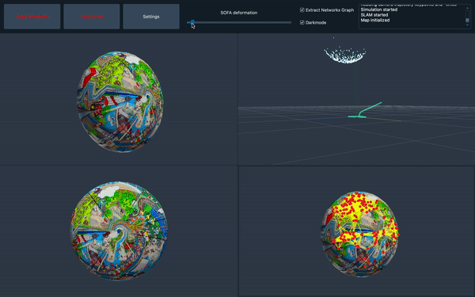

# Model-based SLAM

Model based SLAM is a Simultaneous Localization and Mapping approach for deformable environments.
Please refer to the [docs](docs) or the [website](https://jonahaag.github.io/MOB-SLAM/) for more information on contents.

